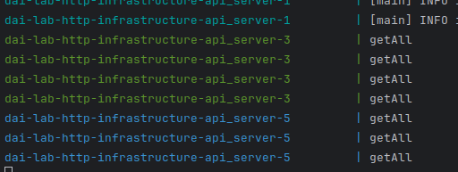

# DAI Lab - HTTP infrastructure

## Group

* Glodi Domingos
* Dominik Saul

## Step 1: Static Web site

The first step of the lab was to configure a NGINX Docker image for container which serves a static site.

All configurations, content and the Dockerfile for this Docker image are located in the directory 'static-web-server' of
this repository.

As content for our static site we've chosen the Bootstrap template 'Agency', which can be downloaded from this
link: https://startbootstrap.com/theme/agency
In our Dockerfile we've configured to use the official NGINX image. In addition we copy the content and the nginx.conf
into the image.

The specific NGINX configuration parameters we documented directly in the nginx.conf file.

## Step 2: Docker compose

With the second step of this lab we've created our docker-compose.yml file.

The services in the docker compose file can be started by using the following command:
`docker compose up`

Use the following command to start the services in the docker compose file and additionally rebuild the images before:
`docker compose up --build`

Command to stop the docker services in the docker compose file:
`docker compose down`

The configuration of our docker-compose.yml file we directly documented in this file.

## Step 3: HTTP API server

The third step of this lab was to create an API Server with the help of the Framework Javalin.
We've decided to develop an API Server to handle and manage a TODO list.

All configurations, code and the Dockerfile for the API server are located in the directory 'api-server' of this
repository.

Our api server supports the following operations:
Read:
GET /api/todo/all > get all todos
GET /api/todo/{id} > get a specific todo

Create:
POST /api/todo/ > create a todo
(the text of the todo needs to be transmitted in the body of the request: the key name is 'text')

Update:
PUT /api/todo/{id} > update the text of a specific todo
(the text of the todo needs to be transmitted in the body of the request: the key name is 'text')
PUT /api/todo/{id}/setDone > mark a specific todo as done
PUT /api/todo/{id}/setUnone > mark a specific todo as undone

Delete:
DELETE /api/todo/{id} > delete a specific todo

To be able to run our Javalin API server in a Docker container we need to create a JAR file from our. To do so we use
maven.
Command to compile server api (needs to be executed from thew api-server folder)
`mvn clean compile assembly:single`

To run this JAR file in a docker container we've created a new Docker image with the Dockerfile 'api-server/Dockerfile'.

Command to docker compose up with rebuilding all images:
`docker compose up --build`

## Step 4: Reverse proxy with Traefik
How we implement the solution:
For this first part we will be using the docker compose file, commands given to traefik and labels given to the other different services.

To establish basic connections, we gave command the following commands:
```
commands:
- "--api.insecure=true"  
- "--providers.docker=true" 
- "--providers.docker.exposedbydefault=false" 
- "--entrypoints.web.address=:80"
- "--entrypoints.websecure.address=:443"

And we mount the following volume
volumes:
- /var/run/docker.sock:/var/run/docker.sock
ports:
- "80:80" 
- "443:443"
- "8080:8080" 
```

Security benefits of a reverse-proxy:
- It is the only element that is exposed directly to the Internet.
- It allow to distribute connections to multiple instances of the same servers to prevent overloads

To acccess Traefik's dashboard go to the following address:
```
http://localhost:8080
```
It will list all entrypoints, routers and services that we've defined in the commands above and all HTTP services that Traefik founds thanks to its access to Docker sockets.  

## Step 5: Scalability and load balancing
To deploy statically multiples instances we add the following commands to the docker compose files to the different services:
```
deploy:
  replicas: 5
```
To deploy dynamically we use the following commands in the terminal where the docker compose file is situated:
```
docker compose up -d --scale <service-name>=<number of instance to create>
```

You can keep tracks of how many available servers in the Traefik dashboard by selecting the relevant service and see the IP address of those servers.

To prove that load-balancing is correctly executed by the reverse-proxy for the nginx servers we can look at the access logs files.
For Javalin ???

## Step 6: Load balancing with round robin and sticky sessions



## Step 7: Securing Traefik with HTTPS

## Optional step 1: Management UI

As a management UI for our docker environment we've chosen Portainer.
Portainer is a webinterface that runs on a docker container and in which the docker environment can be orchestrated.

The documentation how to use Portainer can be found under https://docs.portainer.io/

To use Portainer we've added the service portainer in our docker compose file.
The webinterface of Portainer can then be accessed via the following url: https://localhost:9443/

## Optional step 2: Integration API

We've realised a simple website (api_website) which calls the api server to get the todos and shows them.
Additional there is a form to create new todos and existing todos can be deleted.